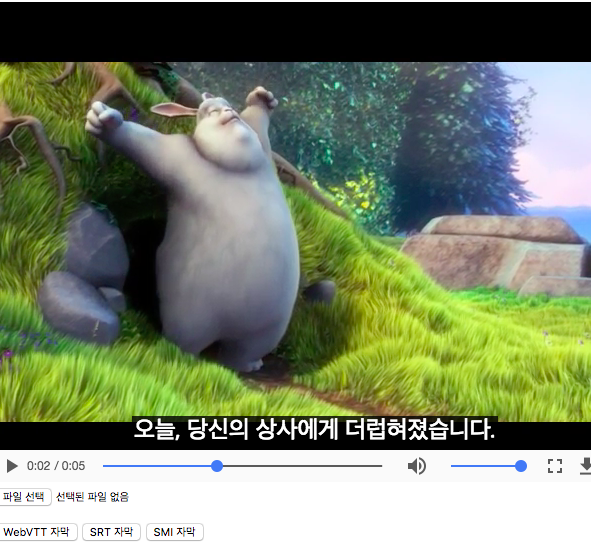
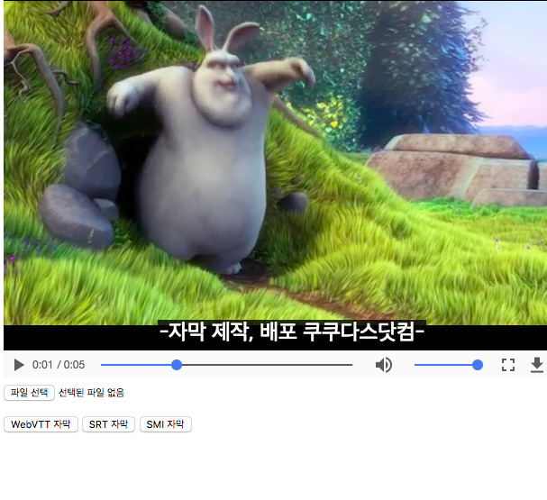

# vttizer

[](https://www.npmjs.com/package/vttizer)

> A library to render many subtitles format on HTML5 video in the browser.

## Demo
> https://u4bi.github.io/vttizer/example

## Install

```html
<script src="https://cdn.rawgit.com/u4bi/vttizer/master/dist/vttizer.min.js"></script>
```

## Usage

```javascript
var subtitles = `...`,
    format    = 'smi' || 'srt' || 'vtt';

var vttizer = new Vttizer(subtitles, format);
vttizer.render(videoElement);
```

## Support

### ✔ SAMI(.smi)
- https://en.wikipedia.org/wiki/SAMI


### ✔ SubRip(.srt)
- https://en.wikipedia.org/wiki/SubRip


### ✔ WebVTT(.vtt)
- https://en.wikipedia.org/wiki/WebVTT


### ✔ Movie Sub
- The.Ritual.2017.1080p.WEB-DL.DD5.1.H264-FGT.smi


---------------------------------------

> # Have Fun! 👀 💥
> 
> 

## License
[MIT](LICENSE)